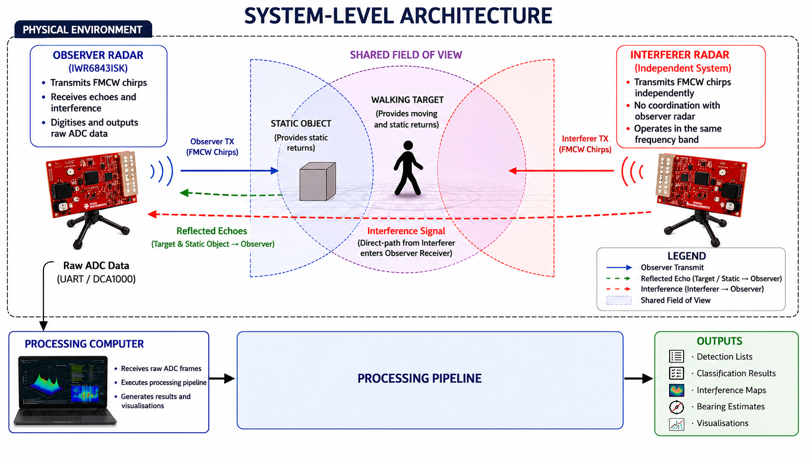
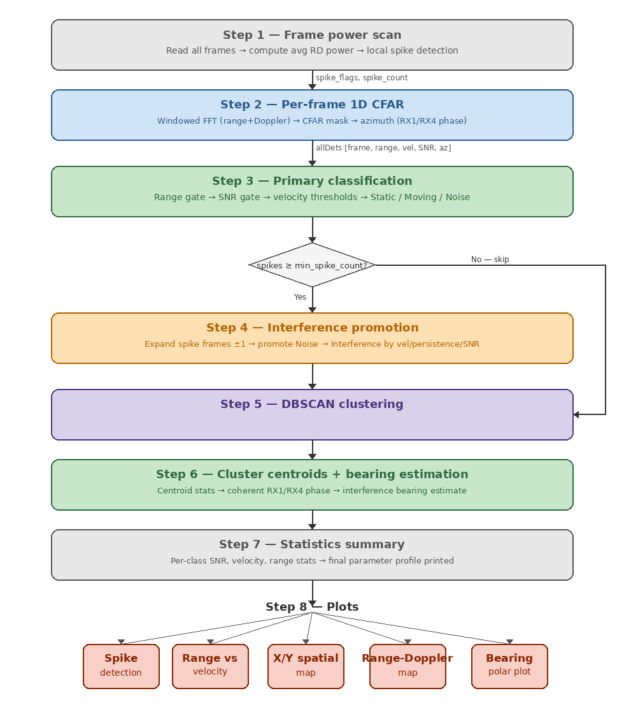
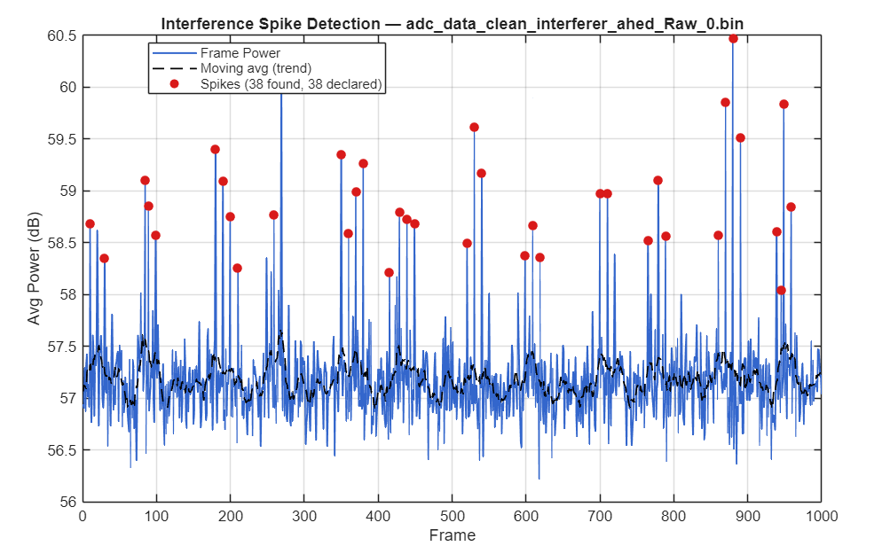
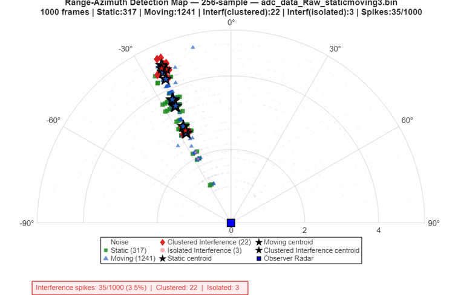
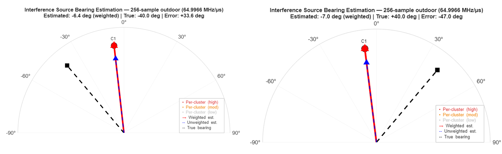

# Interference Characterisation and Localisation for FMCW mmWave Radars

**Master's Thesis — Embedded Systems Engineering**  
**Fachhochschule Dortmund**

This repository contains the MATLAB implementations and selected results from my Master's thesis, **"Interference Characterisation and Localisation for FMCW mmWave Radars."**

The work investigates the detection, classification, characterisation, and localisation of mutual interference between independently operating FMCW millimetre-wave radar systems. The proposed processing pipeline operates on raw ADC measurements from an observer radar without requiring prior knowledge of the interfering radar's waveform parameters, timing, or spatial position.

---

## Research Objectives

The thesis addresses three main challenges:

- **Interference detection:** Determine whether and when mutual interference occurs using locally observed radar data.
- **Detection and classification:** Extract candidate detections and distinguish between static objects, moving objects, background noise, and interference-related detections.
- **Interference source localisation:** Investigate whether phase information associated with interference detections can be used to estimate the angular direction of the interfering radar.

The complete system additionally characterises interference by separating spatially consistent, repeating interference patterns from isolated interference events.

---

## System Architecture

The experimental system consists of an observer radar, an independently operating interfering radar, and real physical targets. Raw ADC data from the observer radar are captured and processed offline in MATLAB.

The experiments were conducted in both indoor and outdoor environments to investigate the influence of measurement conditions and multipath propagation on interference detection, classification, and bearing estimation.

---

## Processing Pipeline

The developed processing pipeline operates directly on raw ADC measurements and combines signal processing, detection, rule-based classification, temporal analysis, and clustering.

The main processing stages are:

1. Raw ADC data parsing and complex I/Q reconstruction
2. Range FFT and Doppler FFT processing
3. Frame-level interference detection based on local power spikes
4. CA-CFAR target detection with DC leakage handling
5. Rule-based classification into Static, Moving, and Noise detections
6. Secondary Noise-to-Interference promotion
7. DBSCAN clustering and interference characterisation
8. Phase-based exploratory interference source bearing estimation

The processing thresholds were derived empirically from dedicated baseline recordings rather than assumed directly from prior literature.

---

## Experimental Platform

The experimental setup used Texas Instruments FMCW mmWave radar hardware.

- **Observer radar:** TI IWR6843ISK-ODS
- **Interfering radar:** TI IWR6843AOP
- **Raw ADC acquisition:** TI DCA1000
- **Operating frequency:** 60 GHz
- **Processing environment:** MATLAB
- **Measurement environments:** Indoor and outdoor
- **Target scenarios:** Clean, static-only, moving-only, static + moving, and active-interference scenarios
- **Interferer positions:** Ahead, left, right, and additional field-of-view/sidelobe conditions

The experiments included different ADC sample configurations and chirp slopes to investigate the effect of radar configuration on interference behaviour.

---

## Interference Detection

Interference presence is first evaluated at frame level using changes in the mean Range-Doppler power. A frame is identified as a potential interference event when its power forms a sufficiently strong local spike relative to neighbouring frames.

This provides a temporal baseline for the subsequent detection-level interference separation stage. Candidate detections initially classified as Noise are reconsidered for promotion to the Interference class based on temporal correlation with detected interference events and additional signal characteristics.

---

## Detection and Classification

Candidate detections are extracted using CA-CFAR processing and subsequently classified using empirically derived SNR and velocity criteria.

The pipeline distinguishes four final detection categories:

- **Static objects**
- **Moving objects**
- **Noise**
- **Interference**

DBSCAN clustering is subsequently applied to characterise interference detections as either spatially consistent **clustered interference** or **isolated interference**.

The experiments showed that radar configuration has a significant influence on the observed interference artefacts. In particular, the apparent Range-Doppler characteristics of interference are dependent on the observer radar configuration and therefore cannot be treated as fixed physical properties of the interfering radar.

---

## Interference Source Bearing Estimation

An exploratory bearing-estimation stage was developed to investigate whether the phase information contained in clustered interference detections could be used to estimate the direction of the interference source.

The method uses coherent phase averaging between receive antenna channels. An independent antenna-pair analysis was additionally performed as a cross-check of the observed bearing behaviour.

The bearing estimates demonstrated strong repeatability within individual measurement scenarios. However, the estimated direction did not consistently track the true physical position of the interferer. Similar convergence behaviour was observed across different environments and was reproduced using an independent receive-antenna pair.

These findings indicate that the phase-estimation mechanism itself produces repeatable measurements, while a systematic effect common to the evaluated configurations prevents reliable absolute interference-source localisation. The thesis therefore treats bearing estimation as an exploratory investigation and documents its observed limitations rather than claiming a fully resolved localisation solution.

---

## MATLAB Code

Four separate MATLAB codebases were developed and used during the thesis.

| Code | Description | Role in the Thesis |
|---|---|---|
| `Threshold_derivation_script.m` | Profiles dedicated baseline recordings to derive SNR, velocity, persistence, and DBSCAN parameters | Threshold derivation |
| `Main_pipeline_indoor.m` | Implements the complete processing pipeline for indoor measurements | Corrected indoor results |
| `Outdoor_pipeline_initial_approach.m` | Initial implementation of the processing pipeline for outdoor measurements | Original outdoor analysis and promotion-approach sensitivity comparison |
| `Outdoor_pipeline_revised_approach.m` | Revised outdoor implementation with an updated Noise-to-Interference promotion approach and independent RX2/RX3 bearing verification | Corrected outdoor results |

The MATLAB implementations are available in the [`Code`](Code/) directory.

### Important Note on Code Versions

The corrected indoor results reported in the final thesis were generated using `Main_pipeline_indoor.m`.

The corrected outdoor results, including the independent RX2/RX3 antenna-pair bearing verification, were generated using `Outdoor_pipeline_revised_approach.m`.

`Outdoor_pipeline_initial_approach.m` is retained because it represents the initial promotion approach and is used as a comparison condition in the promotion-approach sensitivity analysis.

---

## Repository Structure

    Master_Thesis/
    │
    ├── Code/
    │   ├── Main_pipeline_indoor.m
    │   ├── Outdoor_pipeline_initial_approach.m
    │   ├── Outdoor_pipeline_revised_approach.m
    │   └── Threshold_derivation_script.m
    │
    ├── data/
    │   └── README.md
    │
    ├── docs/
    │   └── Khair_Masters_Thesis_Corrected.pdf
    │
    ├── figures/
    │   ├── system_architecture.png
    │   ├── processing_pipeline.png
    │   ├── interference_spike_detection.png
    │   ├── detection_classification.png
    │   └── bearing_estimation_comparison.png
    │
    └── README.md

---

## Dataset Availability

The raw ADC recordings are not included in this GitHub repository because of their large file sizes.

The measurement campaign contains dedicated baseline and interference recordings covering clean, static-only, moving-only, combined static-and-moving, and active-interference scenarios under different radar configurations.

Additional information about the experimental datasets is provided in [`data/README.md`](data/README.md).

---

## Thesis

The complete corrected Master's thesis is available in the [`docs`](docs/) directory.

The thesis provides the theoretical background, system design, experimental implementation, threshold derivation methodology, complete experimental results, and detailed discussion of the limitations identified during interference source bearing estimation.

---

## Technologies and Methods

`MATLAB` · `FMCW Radar` · `mmWave Radar` · `Radar Signal Processing` · `Range-Doppler Processing` · `CA-CFAR` · `DBSCAN` · `Interference Detection` · `Target Classification` · `Direction of Arrival` · `DCA1000` · `TI IWR6843`

---

## Author

**Md Abul Khair**  
Master's in Embedded Systems Engineering  
Fachhochschule Dortmund
